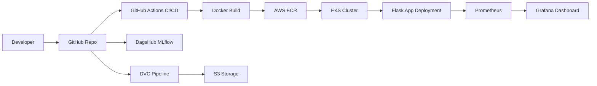

# 🚀 End-to-End MLOps Pipeline (Production Ready)


---

## 📌 Overview

This project demonstrates a **complete MLOps pipeline** covering:

* 📁 Project Structuring
* 📊 Experiment Tracking (MLflow + DagsHub)
* 📦 Data Versioning (DVC + S3)
* 🐳 Containerization (Docker)
* 🔁 CI/CD (GitHub Actions)
* ☸️ Deployment (AWS EKS)
* 📈 Monitoring (Prometheus + Grafana)

---

## 🧱 Architecture Flow



---

## ⚙️ Tech Stack

| Category            | Tools Used              |
| ------------------- | ----------------------- |
| Language            | Python 3.12             |
| Experiment Tracking | MLflow + DagsHub        |
| Data Versioning     | DVC + S3                |
| Backend API         | Flask                   |
| Containerization    | Docker                  |
| CI/CD               | GitHub Actions          |
| Cloud               | AWS (ECR, EKS, S3, EC2) |
| Monitoring          | Prometheus + Grafana    |

---

## 📁 Project Structure

```
├── src/
│   ├── logger/
│   ├── data_ingestion.py
│   ├── data_preprocessing.py
│   ├── feature_engineering.py
│   ├── model_building.py
│   ├── model_evaluation.py
│   └── register_model.py
│
├── flask_app/
├── tests/
├── scripts/
├── dvc.yaml
├── params.yaml
├── requirements.txt
└── .github/workflows/ci.yaml
```

---

## 🚀 Getting Started

### 1️⃣ Clone Repo & Setup Environment

```bash
git clone <your-repo>
cd <repo>

conda create -n atlas python=3.12.12
conda activate atlas

pip install cookiecutter
```

---

### 2️⃣ Generate Project Template

```bash
cookiecutter -c v1 https://github.com/drivendata/cookiecutter-data-science
```

---

## 📊 MLflow + DagsHub Setup

* Connect GitHub repo to DagsHub
* Copy tracking URI
* Install:

```bash
pip install dagshub mlflow
```

---

## 📦 DVC Pipeline

```bash
dvc init
mkdir local_s3
dvc remote add -d mylocal local_s3
dvc repro
```

---

## ☁️ DVC with AWS S3

```bash
pip install "dvc[s3]" awscli
aws configure

dvc remote add -d myremote s3://<bucket-name>
dvc push
```

---

## 🌐 Flask App

```bash
pip install flask
python app.py
```

---

## 🐳 Docker Setup

```bash
docker build -t capstone-app:latest .
docker run -p 8888:5000 capstone-app:latest
```

With environment variable:

```bash
docker run -p 8888:5000 -e CAPSTONE_TEST=<token> capstone-app:latest
```

---

## 🔁 CI/CD Pipeline

* GitHub Actions workflow
* Automated:

  * Testing
  * Docker build
  * Push to ECR
  * Deployment

---

## ☸️ AWS EKS Deployment

```bash
eksctl create cluster \
--name flask-app-cluster \
--region us-east-1 \
--node-type t3.small
```

```bash
aws eks update-kubeconfig --region us-east-1 --name flask-app-cluster
kubectl get nodes
```

---

## 🚀 Application Access

```bash
kubectl get svc flask-app-service
```

Open in browser:

```
http://<external-ip>:5000
```

---

## 📈 Monitoring Setup

### Prometheus

```bash
prometheus --config.file=/etc/prometheus/prometheus.yml
```

Access:

```
http://<ec2-ip>:9090
```

---

### Grafana

```bash
sudo systemctl start grafana-server
```

Access:

```
http://<ec2-ip>:3000
```

* Default login: `admin / admin`
* Add Prometheus datasource

---

## 🔐 Environment Variables

```env
AWS_ACCESS_KEY_ID=
AWS_SECRET_ACCESS_KEY=
AWS_REGION=
AWS_ACCOUNT_ID=
ECR_REPOSITORY=
CAPSTONE_TEST=
```

---

## 🧪 Testing

```
tests/
scripts/
```

Integrated into CI pipeline.

---

## 🧹 Cleanup

```bash
kubectl delete deployment flask-app
kubectl delete service flask-app-service

eksctl delete cluster --name flask-app-cluster
```

Also:

* Delete ECR images
* Delete S3 bucket
* Remove CloudFormation stacks

---

## 🧠 Key Concepts

### 🔹 CloudFormation

* Infrastructure as Code used by EKS

### 🔹 Fleet Requests

* AWS EC2 provisioning limits

### 🔹 PVC (Persistent Volume Claim)

* Kubernetes storage abstraction

---

## 💡 Future Improvements

* ✅ Add Helm Charts
* ✅ Add Model Monitoring (Drift Detection)
* ✅ Add Feature Store
* ✅ Add Canary Deployment
* ✅ Add Alerting in Grafana

---

## ⭐ Contributing

Feel free to fork, raise issues, and submit PRs!

---

## 📬 Contact

For queries or collaboration:

* Open an issue
* Connect via GitHub

---

🔥 **If you like this project, give it a star!**
